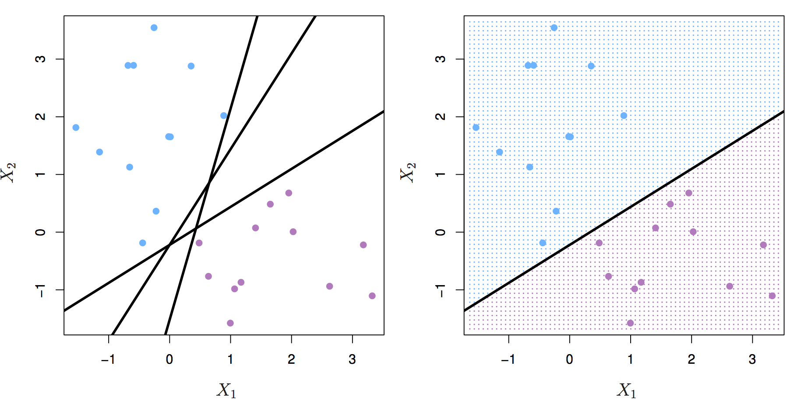
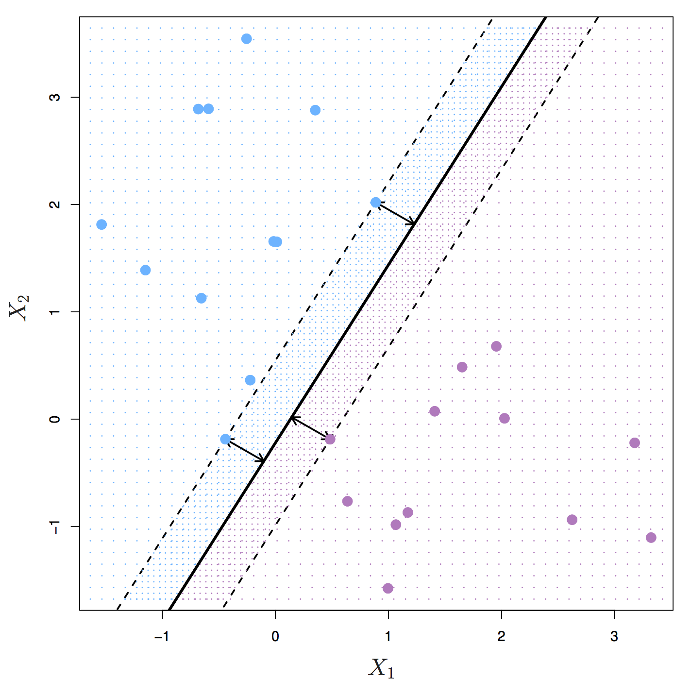
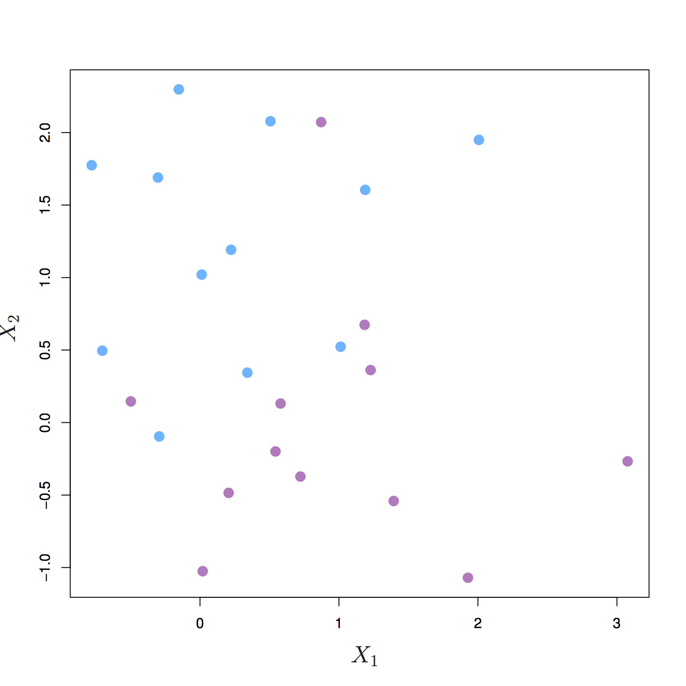
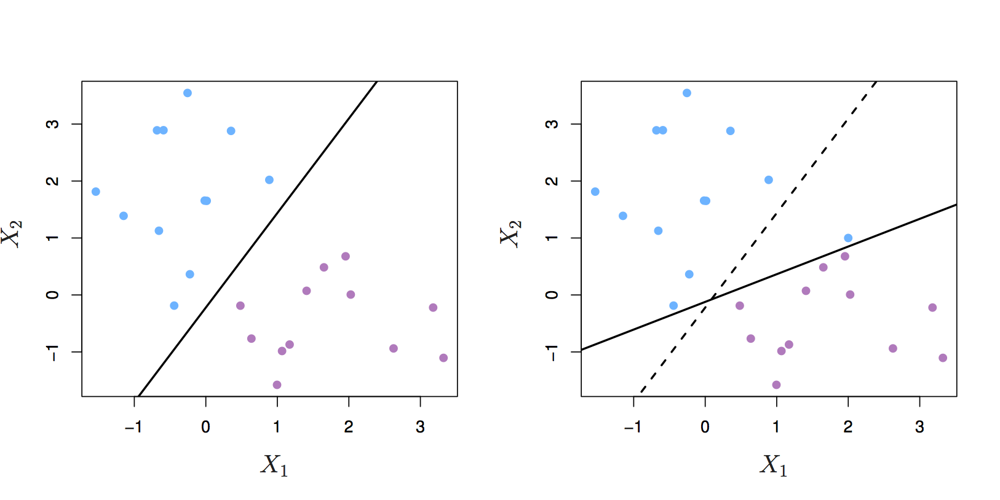
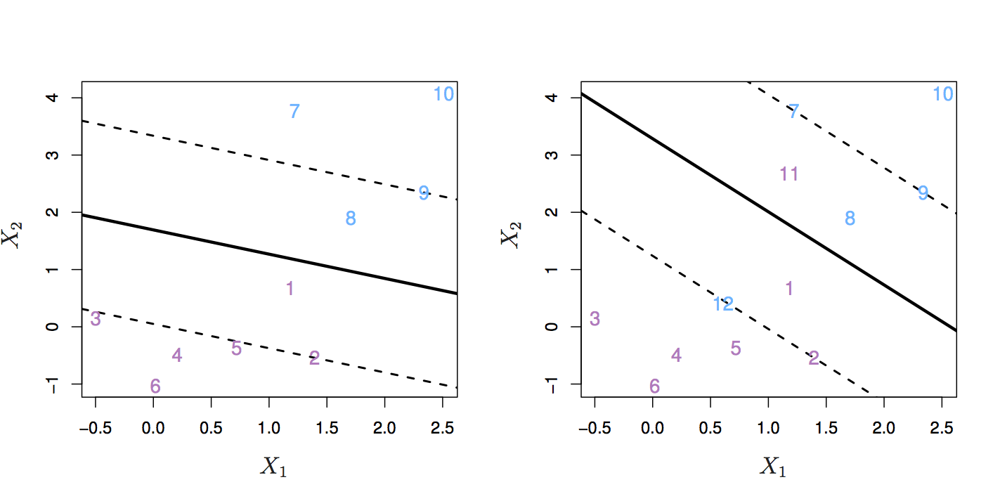
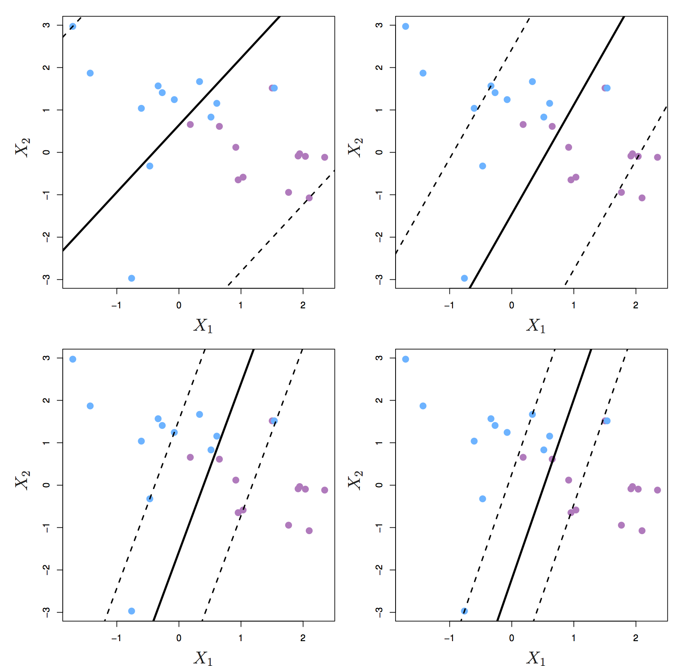

```{r setup, include=FALSE}
knitr::opts_chunk$set(echo = TRUE)
```

# Theoretical part

## SVM

## Introduction
Support vector machines (SVMs) are models of supervised learning, applicable to both classification and regression problems. The SVM is an extension of the support vector classifier (SVC), which is turn is an extension of the maximum margin classifier. 

### Maximum margin classifier
Let's start by definining a hyperplane. In _p_-dimensional space a hyperplane is a flat affine subspace of _p_-1. Figure \@ref(fig:svmSeparatingHyperplanes2) shows three separating hyperplanes and objects of two different classes. A separating hyperplane forms a natural linear decision boundary, classifying new objects according to which side of the line they are located.

```{r svmSeparatingHyperplanes2, echo=FALSE, out.width='90%', fig.align='center', fig.cap="Left: two classes of observations (blue, purple) and three separating hyperplanes. Right: separating hyperplane shown as black line and grid indicates decision rule. Source: http://www-bcf.usc.edu/~gareth/ISL/"}

```

If the classes of observations can be separated by a hyperplane, then there will in fact be an infinite number of hyperplanes. So which of the possible hyperplanes do we choose to be our decision boundary? 

The **maximal margin hyperplane** is the separating hyperplane that is farthest from the training observations. The perpendicular distance from a given hyperplane to the nearest training observation is known as the **margin**. The maximal margin hyperplane is the separating hyperplane for which the margin is largest.

```{r svmMaximalMarginHyperplane, echo=FALSE, out.width='75%', fig.align='center', fig.cap="Maximal margin hyperplane shown as solid line. Margin is the distance from the solid line to either of the dashed lines. The support vectors are the points on the dashed line. Source: http://www-bcf.usc.edu/~gareth/ISL/"}

```

Figure \@ref(fig:svmMaximalMarginHyperplane) shows three training observations that are equidistant from the maximal margin hyperplane and lie on the dashed lines indicating the margin. These are the **support vectors**. If these points were moved slightly, the maximal margin hyperplane would also move, hence the term *support*. The maximal margin hyperplane is set by the **support vectors** alone; it is not influenced by any other observations.

The maximal margin hyperplane is a natural decision boundary, but only if a separating hyperplane exists. In practice there may be non separable cases which prevent the use of the maximal margin classifier.
```{r svmNonSeparableCase, echo=FALSE, out.width='75%', fig.align='center', fig.cap="The two classes cannot be separated by a hyperplane and so the maximal margin classifier cannot be used. Source: http://www-bcf.usc.edu/~gareth/ISL/"}

```

## Support vector classifier
Even if a separating hyperplane exists, it may not be the best decision boundary. The maximal margin classifier is extremely sensitive to individual observations, so may overfit the training data.

```{r svmHyperplaneShift, echo=FALSE, out.width='90%', fig.align='center', fig.cap="Left: two classes of observations and a maximum margin hyperplane (solid line). Right: Hyperplane (solid line) moves after the addition of a new observation (original hyperplane is dashed line). Source: http://www-bcf.usc.edu/~gareth/ISL/"}

```


It would be better to choose a classifier based on a hyperplane that:

* is more robust to individual observations
* provides better classification of most of the training variables

In other words, we might tolerate some misclassifications if the prediction of the remaining observations is more reliable. The **support vector classifier** does this by allowing some observations to be on the wrong side of the margin or even on the wrong side of the hyperplane. Observations on the wrong side of the hyperplane are misclassifications.

```{r svmObsOnWrongSideHyperplane, echo=FALSE, out.width='90%', fig.align='center', fig.cap="Left: observations on the wrong side of the margin. Right: observations on the wrong side of the margin and observations on the wrong side of the hyperplane. Source: http://www-bcf.usc.edu/~gareth/ISL/"}

```

The support vector classifier has a tuning parameter, _C_, that determines the number and severity of the violations to the margin. If _C_ = 0, then no violations to the margin will be tolerated, which is equivalent to the maximal margin classifier. As _C_ increases, the classifier becomes more tolerant of violations to the margin, and so the margin widens.

The optimal value of _C_ is chosen through cross-validation.  

_C_ is described as a tuning parameter, because it controls the bias-variance trade-off:

* a small _C_ results in narrow margins that are rarely violated; the model will have low bias, but high variance.
* as _C_ increases the margins widen allowing more violations; the bias of the model will increase, but its variance will decrease.

The **support vectors** are the observations that lie directly on the margin, or on the wrong side of the margin for their class. The only observations that affect the classifier are the support vectors. As _C_ increases, the margin widens and the number of support vectors increases. In other words, when _C_ increases more observations are involved in determining the decision boundary of the classifier.

```{r svmMarginC, echo=FALSE, out.width='75%', fig.align='center', fig.cap="Margin of a support vector classifier changing with tuning parameter C. Largest value of C was used in the top left panel, and smaller values in the top right, bottom left and bottom right panels. Source: http://www-bcf.usc.edu/~gareth/ISL/"}

```


## Probabilities

# Hands-on practical
